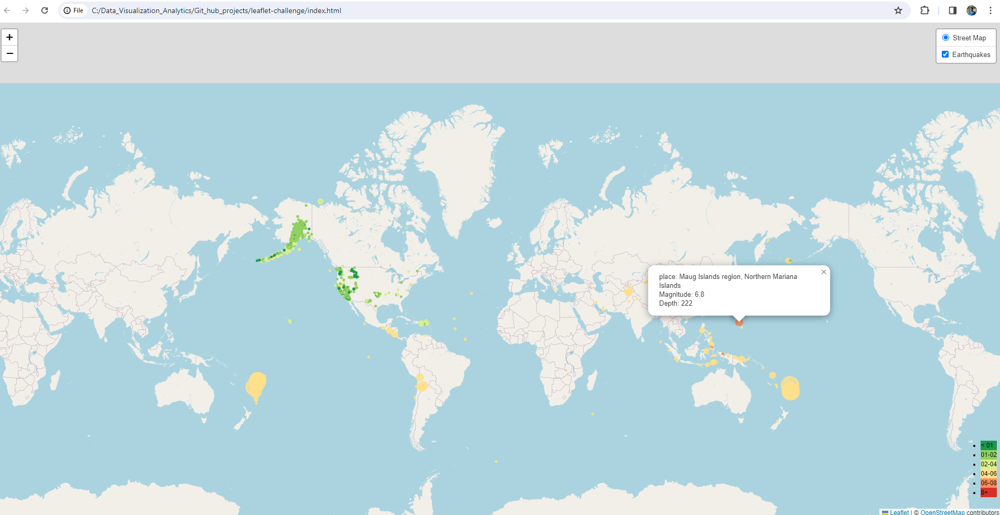
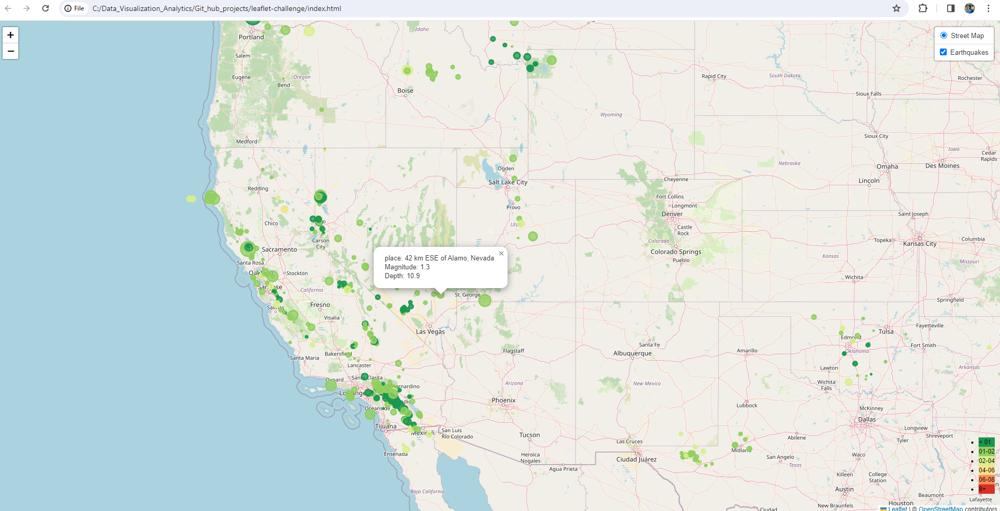

# leaflet-challenge
Module 15 - leaflet-challenge

Github Page:
https://indubt.github.io/leaflet-challenge/

## Background
The United States Geological Survey, or USGS for short, is responsible for providing scientific data about natural hazards, the health of our ecosystems and environment, and the impacts of climate and land-use change. Their scientists develop new methods and tools to supply timely, relevant, and useful information about the Earth and its processes.

The USGS is interested in building a new set of tools that will allow them to visualize their earthquake data. They collect a massive amount of data from all over the world each day, but they lack a meaningful way of displaying it. In this challenge, you have been tasked with developing a way to visualize USGS data that will allow them to better educate the public and other government organizations (and hopefully secure more funding) on issues facing our planet.

## Create Earthquake Visualization

To create Earthquake Visualization, based on the instructions provided in the challenge, followed the below steps:

1. Created git hub repo, cloned the repo in local and uploaded the basic starter files.
2. Fetch the Geo Json Data for the week from [USGS](https://earthquake.usgs.gov/earthquakes/feed/v1.0/summary/all_week.geojson) 
3. Parse the data, loop through the records and create Markers to be marked on the map
4. Create base open street map and update the map with markers created above.

Below screenshot shows the Earthquake Visualization zoomed out.

Note: Legend is created based on the magnitude of the earthquake

Below screenshot shows the Earthquake visualization zoomed near Nevada.

